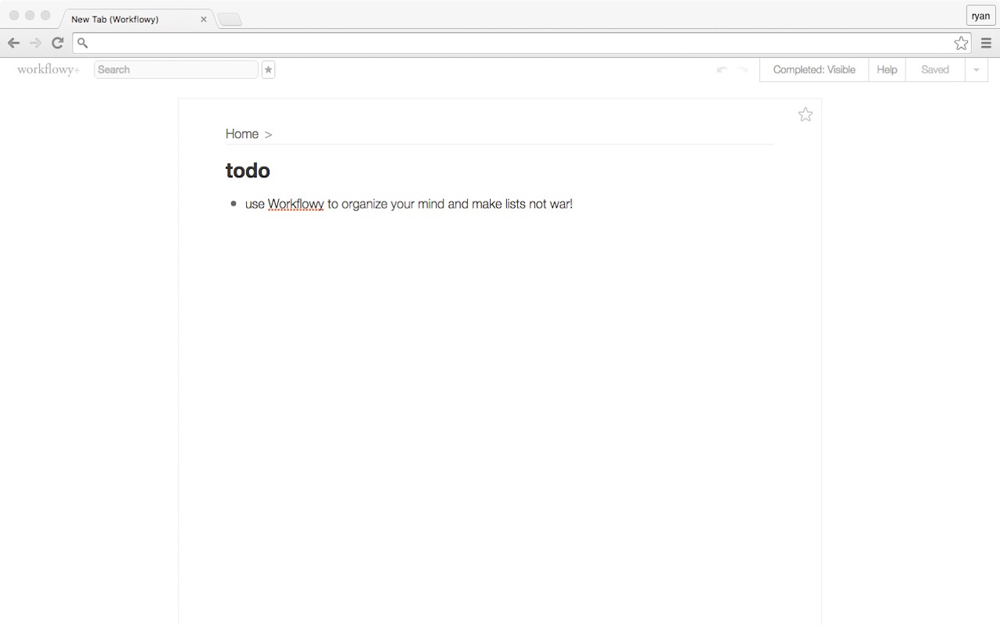

# workflowy-newtab
A Chrome extension to make a Workflowy list your "New Tab" page.

Improve your productivity by replacing your favorite (and likely most distracting) websites with Workflowy.  Take a break from what you're doing by accomplishing something from your lists or write down a quick idea as soon as it comes to you.

Unlike most other New Tab replacement extensions this one maintains cursor focus in Chrome's Omnibox so that you can still just start typing the site you want to navigate to.

_The overall approach (using an iframe to redirect so as to not break the default UX) is borrowed from [New Tab to Tasks](https://chrome.google.com/webstore/detail/new-tab-to-tasks/bokbgdhblfolpfanocjafjhpjkebhlfk) by [Scott Graham](http://h4ck3r.net)._